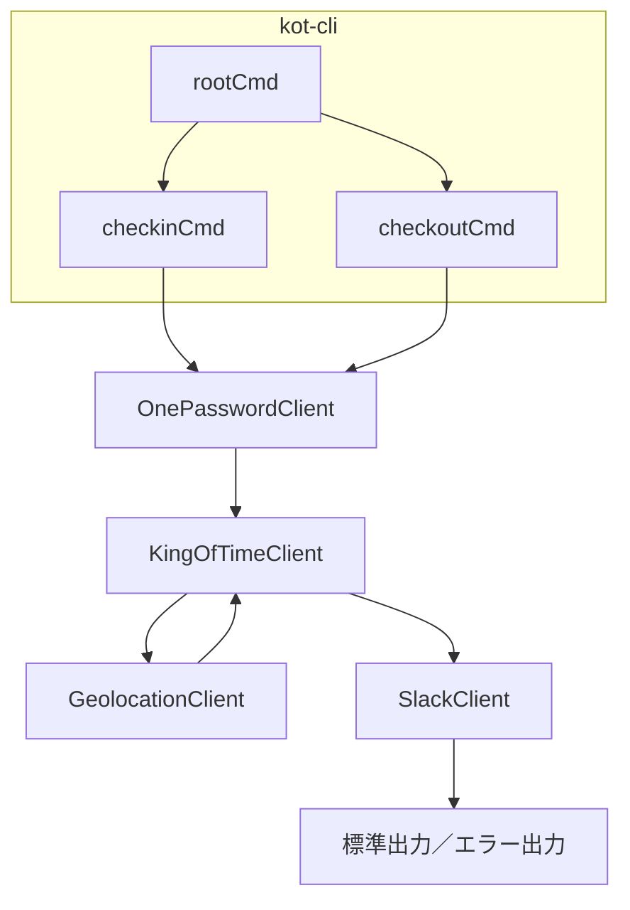

# kot-cli 実装プラン

## 概要
- コマンド: `kot-cli checkin` / `kot-cli checkout`
- オプション
  - `--name <従業員名>` (必須)
  - `--verbose` (詳細ログ)
- 打刻タイムスタンプ: 常に現在時刻を使用
- 位置情報: IPジオロケーションAPIで自動取得

## フロー図


## プロジェクト構成
```
.
├ cmd/
│   ├ root.go
│   ├ checkin.go
│   └ checkout.go
├ internal/
│   ├ onepassword/
│   │   └ client.go
│   ├ kot/
│   │   └ client.go
│   ├ geolocation/
│   │   └ client.go
│   └ slack/
│       └ client.go
└ main.go
```

## フラグ・オプション
- `--name <従業員名>` (必須)
- `--verbose`

## 認証・設定取得（1Password CLI連携）
```bash
op item get "KingOfTimeAPI" --fields Token,UserID --format json
op item get "SlackWebhook"   --fields URL        --format json
```

## 位置情報取得
- IPジオロケーションAPI例: `https://ipapi.co/json`
- `GeolocationClient.GetLocation() (latitude, longitude, error)`

## King of Time API クライアント
- `GetEmployeeID(name string) (string, error)`
- `CheckIn(userID, token, timestamp, lat, lon)`
  - POST `/v1/attendance/check_in`
- `CheckOut(userID, token, timestamp, lat, lon)`
  - POST `/v1/attendance/check_out`

## Slack 通知
- `Notify(webhookURL, message string) error`

## エラー・ログ
- API/CLI 呼び出し失敗時: 標準エラー出力 → `os.Exit(1)`
- `--verbose` 時は各ステップのログを出力

## テスト
- internal 以下のモック化ユニットテスト

## リリース／CI
- GitHub Actions で `go test` → バイナリビルド